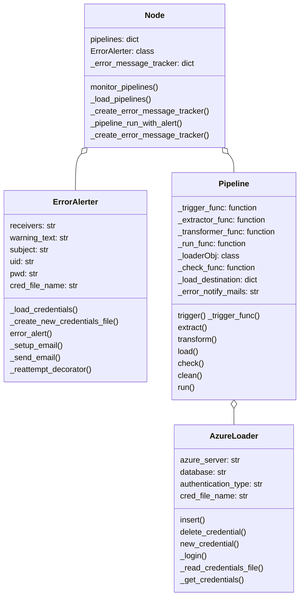

# figuring out Mermaid

```mermaid
classDiagram
    class Node {
        pipelines: dict
        ErrorAlerter: class
        _error_message_tracker: dict
        monitor_pipelines()
        _load_pipelines()
        _create_error_message_tracker()
        _pipeline_run_with_alert()
        _create_error_message_tracker()
    }   
    
    class ErrorAlerter {
        receivers: str
        warning_text: str
        subject: str
        uid: str
        pwd: str
        cred_file_name: str 
        _load_credentials()
        _create_new_credentials_file()
        error_alert()
        _setup_email()
        _send_email()
        _reattempt_decorator()
    }

    class AzureLoader {
        azure_server: str
        database: str
        authentication_type: str
        cred_file_name: str
        insert()
        delete_credential()
        new_credential()
        _login()
        _read_credentials_file()
        _get_credentials()
    }

    class Pipeline {
        _trigger_func: function
        _extractor_func: function
        _transformer_func: function
        _run_func: function
        _loaderObj: class
        _check_func: function
        _load_destination: dict
        _error_notify_mails: str
        trigger() _trigger_func()
        extract()
        transform()
        load()
        check()
        clean()
        run()
    }

    Node o-- Pipeline
    Node o-- ErrorAlerter
    Pipeline o-- AzureLoader

    

```